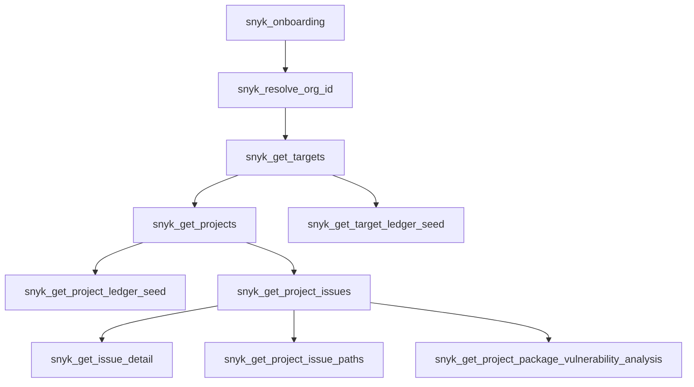

# `snyk-api-mcp`

[](.github/workflows/release.yml)
[](https://github.com/xbaun/snyk-api-mcp/releases)
[](package.json)
[](package.json)

Small, strict, agent-friendly MCP server for Snyk.

It gives AI coding agents a **narrow and predictable** interface for common Snyk workflows: resolve an org, discover targets and projects, list issues, fetch issue detail, inspect dependency paths, and generate ledger seed documents for remediation loops.

The bundled downstream layout also separates **ledger-based remediation** from later **override revalidation** work. See [docs/snyk-skill-topology.md](docs/snyk-skill-topology.md) for the current skill structure.

## Why it is useful

Most Snyk integrations are great for humans, but noisy for agents. This project keeps the surface area intentionally small:

- **Strict identifiers** — `orgId`, `projectId`, `restIssueId`, `vulnerabilityId`, and `issueKey` are not treated as interchangeable.
- **Focused workflows** — tools are split by job instead of collapsing everything into one vague query endpoint.
- **Stable response shapes** — outputs stay predictable and easy for agents to reuse.
- **REST + v1 bridge** — discovery and issue detail use modern Snyk REST APIs, while dependency-path analysis still leverages Snyk API v1 where it is stronger.
- **Downloadable agent and skill definitions** — releases include a downloadable `layout/` archive with `.github/agents`, `.github/skills`, and `.snyk/` files for downstream repos.

## What the project does

### Core workflows

| Workflow | Tools |
| --- | --- |
| Onboarding | `snyk_onboarding` |
| Org + target discovery | `snyk_resolve_org_id`, `snyk_get_targets`, `snyk_get_projects` |
| Issue intake | `snyk_get_target_ledger_seed`, `snyk_get_project_ledger_seed` |
| Issue investigation | `snyk_get_project_issues`, `snyk_list_org_issues`, `snyk_get_issue_detail` |
| Dependency analysis | `snyk_get_project_issue_paths`, `snyk_get_project_package_vulnerability_analysis`, `snyk_get_package_issue_description` |

### Identifier model

| Field | Meaning |
| --- | --- |
| `orgId` | Snyk organization UUID |
| `projectId` | Snyk project UUID |
| `restIssueId` | Snyk REST issue resource UUID |
| `vulnerabilityId` | Snyk vulnerability identifier such as `SNYK-JS-...` |
| `issueKey` | Internal bridge key used for legacy path analysis |

If you only remember one rule from this README, make it this one: **do not mix these identifiers**.

## Get started

### Prerequisites

- Node.js `>= 22`
- `pnpm`
- a Snyk API token

### Install and build

```sh
pnpm install
pnpm run build
```

### Runtime configuration

The server reads these environment variables at runtime:

| Variable | Required | Default |
| --- | --- | --- |
| `SNYK_TOKEN` | yes | — |
| `SNYK_API_BASE` | no | `https://api.eu.snyk.io` |
| `SNYK_API_VERSION` | no | `2026-03-25` |

`.env` files are **not** loaded automatically by the server. MCP clients should pass these variables explicitly.

### Quick client setup

Works with any stdio-based MCP client. A minimal VS Code / GitHub Copilot setup using `npx` looks like this:

```jsonc
{
  "inputs": [
    {
      "type": "promptString",
      "id": "snyk_token",
      "description": "Snyk API Token",
      "password": true
    }
  ],
  "servers": {
    "snyk-api": {
      "command": "npx",
      "args": ["-y", "--package", "@xbaun/snyk-api-mcp", "snyk-api-mcp"],
      "env": {
        "SNYK_TOKEN": "${input:snyk_token}",
        "SNYK_API_BASE": "https://api.eu.snyk.io",
        "SNYK_API_VERSION": "2026-03-25"
      }
    }
  }
}
```

## Typical workflow

Start with `snyk_onboarding`, then walk the identifiers forward step by step.



### Example flow

```text
1. snyk_resolve_org_id(orgSlug)
2. snyk_get_targets(orgId)
3. snyk_get_projects(orgId, targetId)
4. snyk_get_project_issues(orgId, projectId, issueType='package_vulnerability', severity='critical', status='open')
5. snyk_get_issue_detail(...) or snyk_get_project_issue_paths(...)
```

Use ledger seed tools when you want to initialize remediation sessions instead of manually iterating issues.

## Download agent and skill definitions

Each GitHub release attaches `snyk-api-mcp-layout.tar.gz`.

Use it to copy the repository `layout/` contents into another repository, including:

- `.github/agents`
- `.github/skills`
- `.snyk/`

Example:

```sh
curl -fsSL https://github.com/xbaun/snyk-api-mcp/releases/latest/download/snyk-api-mcp-layout.tar.gz \
  | tar -xzf - -C .
```

This is the fastest way to add the bundled agent and skill definitions to a downstream repo.

## How to use the bundled agents skills

The bundled `layout/.github/skills/` directory contains five skills, but they are **not** all meant to be used the same way.

Three skills are the real operator entry points:

| Skill | Use it when | Main input | Main outcome |
| --- | --- | --- | --- |
| `snyk-session-init` | you want to start a new remediation session from Snyk MCP seed data | `orgId` plus exactly one of `targetId` or `projectId` | creates `.synk/{sessionId}/issues-ledger-seed.json` and `.synk/{sessionId}/issues-ledger.json` |
| `snyk-ledger-remediation` | you already have a session ledger and want to process advisories deterministically | `.synk/{sessionId}/issues-ledger.json` | selects an advisory, dispatches the correct resolver, validates the handback, and updates the ledger |
| `snyk-override-revalidation` | you already have dependency overrides and want to check whether they are still needed | `snyk-dep-overrides.pnpm.json`, `pnpm-workspace.yaml`, lockfiles/manifests | keeps, narrows, or removes stale overrides based on current dependency evidence |

Two skills are supporting building blocks rather than first-line workflow entry points:

| Skill | Role |
| --- | --- |
| `snyk-dep-analysis` | deterministic dependency fact gathering (`dep.py inspect|trace|verify`) for resolvers and override review flows |
| `snyk-dep-overrides` | deterministic override materialization and validation (`overrides.py analyze|upsert|materialize|validate|remove`) |

### Recommended flow in a downstream repo

Use these skills in this order depending on what job you are doing:

1. **Start a new remediation session** with `snyk-session-init`.
2. **Work the ledger** with `snyk-ledger-remediation` until the session is complete.
3. **Revisit existing overrides later** with `snyk-override-revalidation` when dependency upgrades or graph changes may have made them obsolete.

The support skills fit underneath those workflows:

- `snyk-ledger-remediation` may rely on `snyk-dep-analysis` for dependency reachability facts.
- `snyk-ledger-remediation` and `snyk-override-revalidation` may rely on `snyk-dep-overrides` for override pre-flight checks, materialization, and validation.

### Important usage guidance

- Do **not** treat `snyk-ledger-remediation` and `snyk-override-revalidation` as the same workflow. The first is ledger-driven advisory remediation; the second is override cleanup and revalidation.
- Do **not** start with `snyk-dep-analysis` or `snyk-dep-overrides` unless you are intentionally doing lower-level helper work. They support the higher-level skills; they are usually not the first operator command.
- Keep session creation separate from remediation. `snyk-session-init` creates the canonical session artifacts, and `snyk-ledger-remediation` consumes them.

For the rationale behind this split, see [docs/snyk-skill-topology.md](docs/snyk-skill-topology.md).

## Development

### Common commands

```sh
pnpm run dev
pnpm run build
pnpm run lint
pnpm run build:layout-archive
pnpm run gen:snyk-rest
pnpm run gen:snyk-api-v1
```

### Project shape

```text
src/
  index.ts                MCP bootstrap
  tools/                  MCP tool definitions
  snyk/client.ts          Snyk API access
  utils/                  focused helpers
layout/                   bundled agent and skill definitions for downstream repos
docs/                     small reference docs
```

## Help and documentation

If you are using the server:

- start with `snyk_onboarding`
- use [identifier mapping notes](docs/snyk-issue-identifier-mapping.md) when a Snyk UI issue ID does not match the MCP contract
- inspect [AGENTS.md](AGENTS.md) for the design philosophy behind the public tool surface
- follow [CODING.md](CODING.md) for local consistency rules
- open an issue at <https://github.com/xbaun/snyk-api-mcp/issues>

## Maintainers and contributing

This project is maintained by [`@xbaun`](https://github.com/xbaun) and contributors.

Contributions are welcome via issues and pull requests. Before opening a PR:

- keep the MCP contract strict and explicit
- prefer extending existing patterns over adding abstractions
- run `pnpm run build` and `pnpm run lint`
- align with the repository guidance in [AGENTS.md](AGENTS.md) and [CODING.md](CODING.md)

## License

ISC.