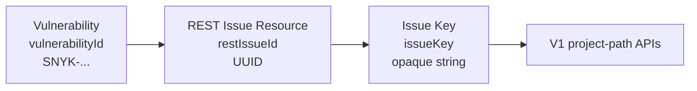

## Überblick

Diese Notiz hält die aktuelle Analyse zur Identifier-Semantik in `snyk-api-mcp` fest.

Im Kern geht es um drei ähnliche, aber **nicht identische** Konzepte:

- `restIssueId`
- `vulnerabilityId`
- `issueKey`

Die wichtigste Erkenntnis ist: Ein generisches `issueId` ist für die MCP-Schnittstelle zu mehrdeutig und sollte nach Möglichkeit vermieden werden.

## Kurzdefinitionen

| Begriff | Typ | Beispiel | Bedeutung |
|---|---|---|---|
| `restIssueId` | UUID | `73832c6c-19ff-4a92-850c-2e1ff2800c16` | ID einer REST Issue Resource |
| `vulnerabilityId` | String | `SNYK-JAVA-COMFASTERXMLWOODSTOX-2928754` | ID der zugrunde liegenden Snyk-Vulnerability |
| `issueKey` | Opaque String | REST `attributes.key` | Korrelations-/Bridge-Identifier zwischen REST-Issue und V1-/Legacy-Flows |
| `issueId` | mehrdeutig | UUID oder String | Zu unscharf für öffentliche MCP-Contracts |

## Was ist ein Issue bei Snyk?

Ein **Issue** ist bei Snyk nicht einfach nur die nackte Schwachstelle.

Ein Issue ist eher ein **kontextualisiertes Finding**, also eine normalisierte Snyk-Feststellung mit:

- Organisations- und Projektkontext
- Lifecycle-Status (`open`, `resolved`)
- Ignore-Status
- Risikobewertung
- Auflösungsinformationen
- fachlicher Ursache (`problems`)
- konkreter Manifestation (`coordinates`, `representations`)

Als Arbeitsmodell gilt daher:

$$
\text{Issue} = \text{Finding im Snyk-Kontext}
$$

und

$$
\text{Vulnerability} = \text{zugrunde liegendes Sicherheitsproblem}
$$

Eine Vulnerability ist damit nicht dasselbe wie ein Issue, sondern eher die fachliche Ursache, die in einem oder mehreren Issues auftauchen kann.

## Die drei Identifier im Zusammenhang

## REST-API: zwei issue-nahe Modelle

Die REST-Typen zeigen, dass Snyk nicht nur **ein** einziges Issue-Modell hat.

### 1. REST Issue Resource

Schema:

- `components["schemas"]["Issue"]`

Identifier:

- `id` ist eine **UUID**

Typische Verwendung:

- `GET /orgs/{org_id}/issues`
- `GET /orgs/{org_id}/issues/{issue_id}`

Bedeutung:

- konkrete REST-Ressource für ein Snyk-Issue
- trägt Status, Risk, Resolution, Relationships, Coordinates usw.

### 2. CommonIssueModelVThree

Schema:

- `components["schemas"]["CommonIssueModelVThree"]`

Identifier:

- `id` ist die **Snyk ID of the vulnerability**
- also typischerweise ein `SNYK-...` String

Typische Verwendung:

- `GET /orgs/{org_id}/packages/{purl}/issues`

Bedeutung:

- issue-/vulnerability-nahe Response-Darstellung auf Package-Ebene
- kein eindeutiger Ersatz für die REST Issue Resource ID

## V1-API

In V1 tauchen ebenfalls issue-bezogene String-Identifier auf. Besonders relevant ist:

- `GET /org/{orgId}/project/{projectId}/issue/{issueId}/paths`

Der dort verwendete `issueId` ist im aktuellen Hybrid-Flow **nicht** die REST-UUID, sondern der aus REST ermittelte `issueKey`.

## Mapping-Tabelle für die MCP-Schnittstelle

| MCP-Feldname | Ursprung | Format | Bedeutung | Empfehlung |
|---|---|---|---|---|
| `restIssueId` | REST `Issue.id` | UUID | konkrete REST Issue Resource | öffentlich verwenden |
| `vulnerabilityId` | REST `CommonIssueModelVThree.id` / advisoryartige Modelle | String | fachliche Schwachstellen-ID | öffentlich verwenden |
| `issueKey` | REST `Issue.attributes.key` | String | REST↔V1 Bridge-Identifier | gezielt exponieren |
| `issueId` | kontextabhängig | UUID oder String | semantisch zu unscharf | in MCP vermeiden |

## Aktuelle Tool-Verwendung im Repo

### Tools mit REST Issue Resource IDs

Diese Flows sollten mit `restIssueId` arbeiten:

- `snyk_get_project_issues`
- `snyk_list_org_issues`
- `snyk_get_issue_detail`
- `snyk_get_project_issue_paths`
- `snyk_get_project_package_vulnerability_analysis`

### Tools mit Vulnerability IDs

Diese Flows liefern eher `vulnerabilityId`-artige IDs:

- `snyk_get_package_issue_description`
- package-bezogene Teile in `snyk_get_project_package_vulnerability_analysis`

### Tools/Flows mit Issue Key

Diese Flows benötigen `issueKey` als Brücke:

- `resolveIssueKeyFromRestId(...)`
- `snyk_get_project_issue_paths`
- `snyk_get_project_package_vulnerability_analysis`

## Aktuelle Contract-Schwäche

Der aktuelle gemeinsame Typ `IssueSummary` verwendet ein generisches Feld:

- `id: string`

Dieses Feld wird derzeit mit **zwei verschiedenen Semantiken** befüllt:

1. als `restIssueId` für REST-Issue-Resource-basierte Responses
2. als `vulnerabilityId` für package-/`CommonIssueModelVThree`-basierte Responses

Dadurch ist die Schnittstelle semantisch weich und für Konsumenten schwer sicher zu interpretieren.

## Empfehlung zur Härtung der MCP-Schnittstelle

### Öffentliche Regel

In öffentlichen MCP-Inputs und -Outputs sollte gelten:

- niemals nur `issueId`
- stattdessen immer explizit:
  - `restIssueId`
  - `vulnerabilityId`
  - `issueKey`

### Konkrete Empfehlungen

#### Für REST-Issue-Resource-basierte Tools

Verwenden:

- `restIssueId`

Optional zusätzlich:

- `issueKey`

#### Für package-/vulnerability-basierte Tools

Verwenden:

- `vulnerabilityId`

Nicht behaupten:

- dass diese ID eine `restIssueId` sei

#### Für V1-Bridge-Flows

Verwenden:

- `issueKey`

aber nur dort, wo der Wert wirklich für Legacy-/Pfad-Endpunkte gebraucht wird.

## Vorschlag für eine robustere Typstruktur

Statt eines einzigen generischen Summary-Typs sollten zwei getrennte Output-Modelle geprüft werden:

### `RestIssueSummary`

Enthält z. B.:

- `restIssueId`
- `issueKey`
- `title`
- `status`
- `risk`
- `scanItemId`
- `organizationId`
- `coordinates`
- `problems`

### `PackageVulnerabilitySummary`

Enthält z. B.:

- `vulnerabilityId`
- `title`
- `description`
- `effectiveSeverityLevel`
- `type`
- package-/fix-bezogene Hinweise

## Fazit

Für die Härtung der MCP-Schnittstelle ist die zentrale Unterscheidung:

- **Issue Resource ID** → UUID
- **Vulnerability ID** → `SNYK-*` String
- **Issue Key** → Bridge-Identifier für Legacy/V1/Korrelation

Das Wort `issueId` allein ist im aktuellen Snyk-Kontext zu unpräzise und sollte in der öffentlichen MCP-Schnittstelle vermieden oder konsequent umbenannt werden.

## Umsetzungsstand im Repo

Die MCP-Schnittstelle wurde entsprechend gehärtet:

- REST-basierte Tool-Outputs verwenden nun `restIssueId` statt eines generischen `id`
- package-basierte Vulnerability-Outputs verwenden `vulnerabilityId`
- `issueKey` bleibt als explizites Bridge-Feld erhalten
- `snyk_get_issue_detail` erwartet jetzt öffentlich `restIssueId` statt `issueId`
- `snyk_get_package_issue_description` liefert `packageVulnerabilities` und `vulnerabilityCount`
